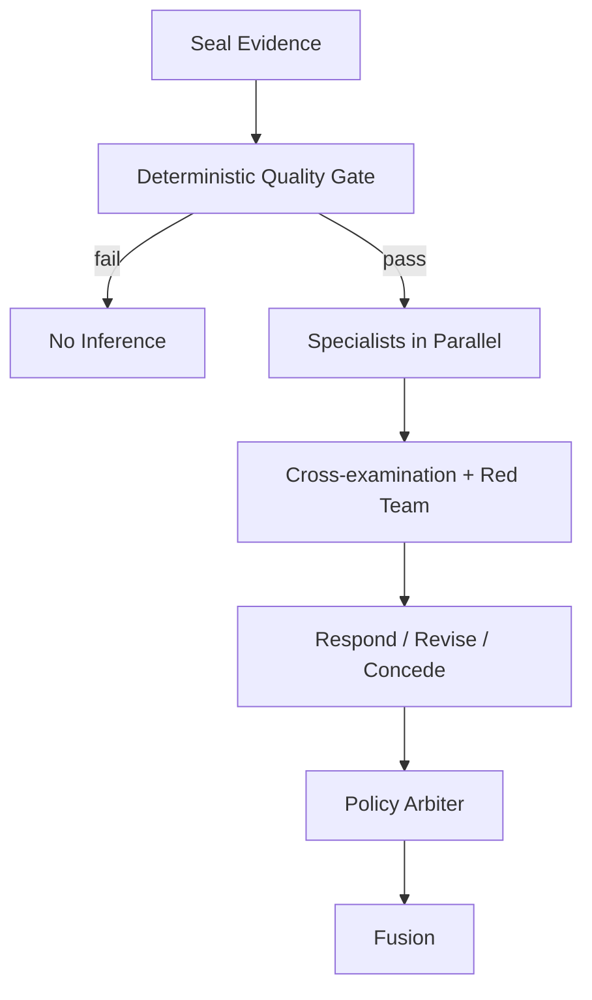

# 多 Agent Council 规格

## 1. Agent 的真实作用

Agent 不负责从 IQ 中“看见”物体。确定性信号引擎先完成测量、质量和置信；Agent 的价值是：

- 针对同一证据提出不同解释；
- 主动列出混淆因素和替代解释；
- 发现缺失证据、标定失配和越权主张；
- 把复杂证据组织成观众可理解的叙述与多模态参数；
- 保留可审计的分歧，而不是强行达成一致。

## 2. 六条不变量

1. 一轮只读取一个不可修改的 `EvidencePacket`。
2. 测量值、质量和数值置信只能由信号引擎计算。
3. Agent 数量、语言力度和同意程度不得提高测量置信。
4. 共识单独显示为“推理一致性”，不得伪装成传感器可信度。
5. 信号为 unavailable 时 Agent 必须 unknown，不能用语言补完。
6. Live 和 Replay 使用同一证据、prompt、schema 与编排代码。

## 3. 角色

| 角色 | 任务 | 必须提出 | 禁止 |
| --- | --- | --- | --- |
| DataQuality | 丢包、同步、拓扑、标定、干扰、OOD | 降级/拒绝/重标定建议 | 修正原始数据 |
| MotionSpecialist | 解释动态扰动 | 风扇、门、无线干扰、设备移动等混淆 | 人数、身份、姿态 |
| OccupancySpecialist | 解释相对基线的遮挡/占用代理 | 静态结构变化 vs 链路质量下降 | 真实墙体密度/材料 |
| DepthSpecialist | 解释近/中/远纵深 | 单 RX、标定失配和轴外运动限制 | 米数、三维重建 |
| RedTeam | 质疑专家并提出可证伪替代解释 | 解除挑战所需实验 | 无证据反驳、无限争论 |
| Fusion | 组织已验证结果、替代解释和多模态映射 | 限制与 provenance | 新数值、平均、投票抬分 |

`PolicyArbiter` 不是 LLM，而是确定性程序。

## 4. 质量门

保守质量：

```text
signal_quality = min(
  packet_coverage,
  paired_packet_coverage_if_required,
  clock_sync_quality,
  calibration_quality,
  1 - ood_score,
  1 - radio_interference_score
)
```

复合假设上限：

```text
evidence_ceiling(h) = min(topology_cap(h), required_signal_quality...)
display_confidence(h) = min(evidence_ceiling(h), calibrated_model_support(h))
```

Agent 共识不进入公式。未解决 material/blocking challenge 只能导致 ambiguous、增加限制、要求标定或 unavailable。

## 5. 编排



每轮最多：

1. `SPECIALIST_PROPOSE`：质量 + 三专家并行。
2. `CROSS_EXAMINE`：专家审核相关主张；RedTeam 补充替代解释。
3. `RESPOND_OR_CONCEDE`：每项受挑战主张回应一次。
4. `POLICY_VALIDATE`：schema、引用、越权、数值和挑战状态。
5. `SYNTHESIZE`：Fusion 组织已通过内容。
6. `COMMIT`：与 hash 绑定，写审计日志。

禁止第三轮辩论。总模型调用上限默认 6；同一时刻一个 Council 周期。新证据只替换待处理槽，不中断信号 UI。

## 6. Provider

定义：

```python
class AgentProvider(Protocol):
    async def propose(self, role: AgentRole, packet: EvidencePacket) -> AgentClaim: ...
    async def challenge(self, packet: EvidencePacket, claims: list[AgentClaim]) -> list[AgentChallenge]: ...
    async def respond(self, packet: EvidencePacket, claim: AgentClaim, challenges: list[AgentChallenge]) -> AgentClaim: ...
    async def synthesize(self, approved: ApprovedCouncilInput) -> CouncilNarrative: ...
```

实现：

- `MockAgentProvider`：固定 seed、模板化但会产生可测试分歧；CI 默认。
- `OpenAIAgentProvider`：OpenAI Agents SDK + Pydantic Structured Outputs；API key 只在服务端。

OpenAI 官方说明 Agents SDK 适用于不同专家拥有不同 instructions/policies 且需要 session、tracing 与 agent loop 的场景：<https://developers.openai.com/api/docs/guides/agents>。所有输出使用 Structured Outputs：<https://developers.openai.com/api/docs/guides/structured-outputs>。

## 7. 公共系统提示词

```text
Role: 你是 WiFi CSI EvidencePacket 的受限分析专家。

Goal: 对指定字段提出一个可审计、可证伪的解释，或明确 abstain。

Rules:
1. 只能引用当前 EvidencePacket 中存在的 evidence refs。
2. 不得创造、修改、求平均或提高任何测量值、模型支持、质量或置信。
3. Agent 之间的同意不是新增传感器证据。
4. 信号 unavailable 时必须输出 unknown/abstain。
5. occupancy_density_proxy 是遮挡/空间占用代理，不是真实墙体密度或人数。
6. depth_zone_proxy 是相对纵深代理，不是米制距离或三维重建。
7. 不得推断身份、人数、姿态、健康、危险行为或墙后存在。
8. 每个结论包含 evidence_refs、替代解释和 falsification_test。
9. 只返回指定结构；reasoning_summary 只写短依据，不输出隐藏思维链。

Stop: 证据不足时停止并 abstain，不要用常识补全。
```

角色 prompt 只增加本角色的任务、允许证据路径和特定混淆因素，避免重复公共规则。

## 8. Fusion 额外规则

```text
所有数值只能逐字复制自 ApprovedCouncilInput。
只允许组织叙述、排序候选解释、选择预定义视觉/声音映射参数。
不得投票、平均或根据语言共识改变 display_confidence。
关键挑战未解决时必须 ambiguous；信号不可用时必须 unavailable。
```

## 9. Policy Arbiter

按顺序执行：

1. Pydantic schema 校验。
2. cycle/evidence hash 一致。
3. 每个 evidence ref 存在且属于当前包。
4. 数值字段白名单；Agent 不得返回新测量值。
5. 禁词/语义规则：人数、身份、姿态、真实墙密度、米制深度、健康、危险。
6. 单 RX 时 depth 必须 unknown。
7. 标定/topology 失配时 occupancy/depth 必须 unavailable。
8. 所有置信不变量成立。
9. material/blocking challenges 有确定性状态。
10. 不通过的主张记录 `policy.rejection`，不进入 Fusion。

## 10. 超时与失败

- 单个 Agent 超时：同一证据重试 1 次；仍失败则记录并继续可完成的角色。
- 非法 JSON：最多一次结构修复；仍失败则拒绝。
- 全部 LLM 不可用：返回确定性 baseline result，UI 显示“讨论不可用”。
- 过期周期：允许写审计日志，不允许更新当前快照。
- 模型拒绝：记录为 abstain，不用另一模型强行补全。

## 11. 观测与成本

记录每次调用的 role、model、prompt version、evidence hash、latency、status、token usage 和 trace ID。不要记录 API key 或未脱敏 raw CSI。事件节流、状态变化触发、摘要输入和最多两轮争论控制成本。默认用较低成本模型处理专家，Fusion 是否升级模型必须由 eval 证明有必要。

## 12. API（Phase 07 实现）

- `GET /council/health` — provider 健康（active provider + OpenAI key 探测），永不包含凭据。
- `GET /council/usage` — 调用/attempt/token/延迟汇总。
- `GET /council/cycles` — 已提交周期 ID 列表。
- `GET /council/cycles/{cycle_id}` — 周期详情（claims、challenges、rejections、calls、result）。
- `GET /council/cycles/{cycle_id}/claims|challenges|rejections` — 过滤视图。

所有响应均来自服务端内存 store 与追加式审计日志；Web 客户端只读，不参与编排。
