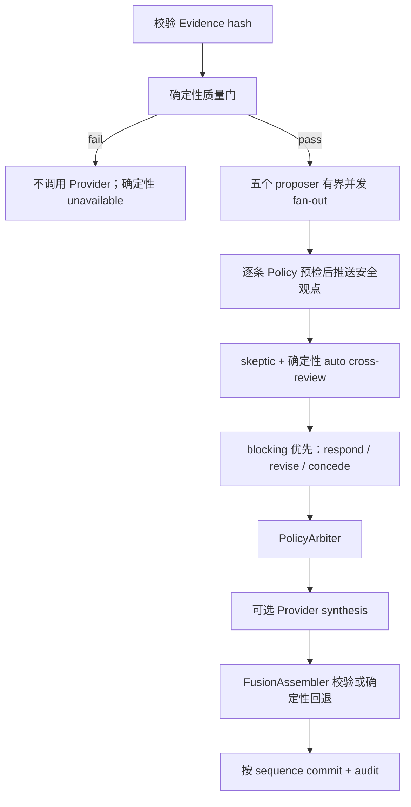

# 多 Agent Council 规格

本文描述当前源码，而不是最初方案。Replay 与 Mock 已验证；Live 已实现但尚未完成真实 ESP32、房间标定和现场指标验证。

## 1. Agent 的真实作用

确定性信号链先从 CSI 生成活动强度、遮挡/空间占用代理和相对纵深代理，并给出质量与传感器置信上限。Council 只读取一个封存的 `EvidencePacket`，负责：

- 用五种可区分的视角组织同一组代理信号；
- 围绕 J 的同一问题判断当前快照是否值得保存并与下一周期对照；
- 给出证据引用、替代解释、可证伪测试和可见分析步骤；
- 由 skeptic 提出混淆因素、缺失证据和越权风险；
- 由确定性 `PolicyArbiter` 拒绝不合规主张、约束挑战严重度和置信链；
- 由 fusion 或确定性回退把已批准内容组织成 Web 可读结果。

Agent 不从 IQ 中识别物体、人物、身份、人数或姿态，也不产生米制纵深。“空间生命体反应”仅把代理状态转成舒展、收紧、靠近、退后等叙事/视觉动词，不表示检测到真实生命或意识；所有创意读法都是 `lens="metaphor"` 的“隐喻解读”，不是新的传感器证据。

## 2. 不变量

1. 一轮只读取一个 hash 校验通过且不可修改的 `EvidencePacket`。
2. Agent 读取标量化的 `FeatureWindow` 摘要和 `SignalTriplet`，不读取 raw CSI 数组。
3. 测量值、质量、信号置信和 `sensor_confidence_cap` 只由确定性信号链计算。
4. `display_confidence <= model_support <= sensor_confidence_cap` 在 Pydantic 合约、Policy 和测试中同时约束。
5. Agent 数量、措辞强度和 `interpretation_agreement` 不进入置信计算。
6. 质量门失败时不调用 Provider；信号不可用时输出明确的 unavailable/unknown。
7. Mock、Replay、Live 共用同一 Evidence、Prompt、Policy、CouncilResult 和 WebSocket 合约。

## 3. 七个实际角色

| 合约角色 | 前端贡献 | 受控状态 / 输出 | 边界 |
| --- | --- | --- | --- |
| `architecture` | 看见空间的形 | 收紧、展开、阻断 | 这里的“看见”是 UI 叙事标题；不把意象写成真实图纸、视觉检测或米制距离 |
| `biota` | 看见空间的息 | 静息、惊跳、恢复 | 只描述环境变化痕迹，不指向具体对象或真实生命 |
| `feng_shui` | 看见空间的流 | 聚、散、滞、冲 | 只作文化叙事隐喻，不把气、吉凶或方位写成测量 |
| `psyche` | 看见空间的势 | 安定、活跃、警觉、漂浮 | 只描述空间势态，不诊断居住者心理、情绪或健康 |
| `soundscape` | 把共识翻译成运动 | 节奏、音高、远近、厚薄、同步 | 前端不显示该角色的文字分析，也不声称采集或识别真实声音 |
| `skeptic` | 检查判断是否成立 | 证据是否充分、是否暂缓、下一步如何验证 | 不输出与目标 claim 脱节的泛化质疑 |
| `fusion` | 让空间生命回应用户 | 当前生命状态、第一人称回应、希望如何互动 | 不创造数值，不投票或平均抬分；生命感只是叙事映射 |

五个 proposer 的知识库位于 `data/knowledge/{role}.json`。Mock Provider 会把命中的公开来源写入 `AgentClaim.sources`；每条主张还可携带 `process`、五步 `analysis_steps` 和三层 `systematic_reading`。知识引用支撑的是解释框架，不把隐喻升级为测量事实。

Provider 的审计文本与产品展示是两层合约：`AgentClaim.presentation` 把四个文字角色投影到上述有限状态，`AgentChallenge.assessment` 把怀疑结论投影为“充分/有限/不足 + 是否暂缓 + 下一步验证”，最终 `CouncilResult.sound_motion` 和 `life_interaction` 分别驱动声音角色与 Fusion。投影只消费封存代理、质量、连续性和已经通过 Policy 的结论，不能修改 `EvidencePacket`、置信或底层数字场几何。原始 Agent 文本仍保留在审计详情中；声音角色的文本只保留在后端审计，不进入主要前端。

## 4. 置信与质量边界

信号层先计算每个代理量的质量和置信，再产生 `sensor_confidence_cap`。Council 的正常可推理路径使用保守链：

```text
model_support = min(
  motion.confidence,
  occupancy_density.confidence,
  depth_zone.confidence,
  sensor_confidence_cap,
  topology_cap
)

display_confidence = model_support                  # 无未解决重大挑战
display_confidence = model_support * 0.75           # material challenge
display_confidence = model_support * 0.50           # blocking challenge
```

`topology_cap` 在纵深输出不被允许时为 0。`insufficient_signal`、`uncalibrated` 或零支持会得到 `unavailable`，显示置信强制为 0。Policy 返回的全部数值仍须满足合约上限。`interpretation_agreement` 仅是解释层统计。

## 5. 当前编排与调用预算



当前 `CouncilOrchestrator` 会并发发出五个 proposer 的首轮调用，以最慢的一次而不是五次耗时之和作为这一段的主要延迟。失败角色只进入一次受预算约束的重试波次；默认 10 次预算会为 skeptic 与 fusion 保留完整调用路径。每条主张在增量推送到 WebSocket 前先经过确定性 Policy 预检；被拒绝的原始文本不会短暂出现在 UI。信号流和 UI 永不等待 Council；`CouncilScheduler` 在后台只保留一个运行周期和一个最新待处理 Evidence 槽。

每个 session 还保存一个**有界的上一周期解释快照**，进程最多保留 32 个 session。下一周期按同一套确定性规则比较 motion、occupancy、depth 与 quality 的类别和显著数值变化，生成 `AgentContinuity`（上一周期 ID、变化项、变化关系和通俗摘要），并把上一条通过 Policy 的角色观点作为“解释上下文”交给同一角色。被拒绝文本不会进入下一轮记忆；上一条观点也不是新传感器证据，不能修改当前 `EvidencePacket`、质量或置信。Replay seek / session 重置时连续性同时清空。

`CouncilConfig` 当前默认值：

| 项 | 实现值 |
| --- | --- |
| Provider 调用预算 | `max_calls_per_cycle=10` |
| 单调用超时 | `agent_timeout_s=8.0` |
| 尝试次数 | `retry_attempts=2`（失败后重试一次） |
| 周期硬时限 | `cycle_deadline_s=15.0` |
| 连续分析刷新目标 | `analysis_refresh_s=7.0` |
| 挑战总数上限 | `max_challenges_total=12` |

一次无重试、无回应的完整路径是 5 次 propose + 1 次 skeptic + 1 次 fusion，即 7 次调用；回应或失败重试最多使用剩余预算。重试记录同样计入预算，预算不足时后续回应或 Provider synthesis 会被跳过，由确定性 Fusion 回退完成结果。禁止第三轮辩论。15 秒周期超时返回可审计的 `ambiguous` 基线，不让过期周期覆盖新快照。

`analysis_refresh_s=7.0` 表示流在没有更早状态触发时，大约每 7 秒封存一份最新代理快照，供七个角色继续分析；它不是伪造采样率，也不保证网络模型恰好 7 秒完成。若上一轮仍在运行，只保留最新 pending 快照。`cycle.started` 携带该轮精确 `signal_snapshot`，前端观点和数字场因此引用同一封存时刻，而不会把较新的环境状态错配给较旧观点。

## 6. Provider 接口与真实模型边界

Provider 返回带模型、耗时、token、状态和错误摘要的 `ProviderCall[T]`，结构化载荷为 Pydantic 模型：

```python
class AgentProvider(Protocol):
    async def propose(role, packet, prompt) -> ProviderCall[SpecialistProposal]: ...
    async def challenge(packet, claims, prompt) -> ProviderCall[ChallengeSet]: ...
    async def respond(packet, claim, challenges, prompt) -> ProviderCall[ResponseOutput]: ...
    async def synthesize(approved, prompt) -> ProviderCall[SynthesisOutput]: ...
    def health() -> ProviderHealth: ...
```

- `MockAgentProvider`：默认和 CI 使用；固定 seed、知识库与模板，结果可重复。它验证完整编排，但不代表真实大模型调用。
- `OpenAIAgentProvider`：OpenAI Agents SDK + Pydantic `output_type`；只从服务端读取 `OPENAI_API_KEY`，模型由 `AGENT_COUNCIL_MODEL` 指定。
- `DeepSeekAgentProvider`：通过显式的 OpenAI-compatible client 调用 DeepSeek Chat Completions，使用 JSON Object 模式并由本地 Pydantic 合约再次校验；只读取服务端 `DEEPSEEK_API_KEY`，模型由 `DEEPSEEK_COUNCIL_MODEL` 指定。为降低复杂 schema 的脆弱度并强化安全边界，DeepSeek 只返回角色叙事子结构；`measurement_summary`、reaction、场景问题、角色 lens、evidence refs、知识来源、分析步骤以及 Fusion 的视觉/声音参数均由服务器从 sealed packet 确定性回填。skeptic 的 target/ref 也会绑定回本周期，模型无法借 JSON 输出改变测量或跨周期引用。项目直接声明 `openai` client 依赖，是因为该 provider 在源码中直接导入它，而不依赖 `openai-agents` 的传递依赖。
- `provider_types.py` 只定义 Provider 协议与可审计调用信封，`mock_provider.py`、`openai_provider.py`、`deepseek.py` 分别承载实现；`provider.py` 仅保留兼容导出。`grounding.py` 集中保存 Mock 与 DeepSeek 共用的公开、确定性证据映射和知识检索辅助函数，两个 Provider 不再跨模块导入下划线私有函数。`presentation.py` 单独负责七角色的 UI 投影，使 Provider 网络代码、审计内容和产品表现可以独立测试和扩展。
- Provider `health()` 的 `configured` 只说明服务端存在 key，不是网络调用证明。无 key 时调用状态为 `offline`，最终返回“讨论不可用”的确定性基线，不会冒充真实模型。
- 真实 Provider 只有在 opt-in smoke 成功，或 `/api/agent/invoke` 返回匹配的 `provider` 且 `real_model_calls >= 7` 后，才可写成“已验证”。`real_model_calls` 只统计 `status=ok` 的实际请求；`cache_hit` 不计入真实调用次数。

```bash
COUNCIL_OPENAI_SMOKE=1 OPENAI_API_KEY=... \
  uv run python -m pytest tests/council/test_providers.py -m openai_smoke -q

COUNCIL_DEEPSEEK_SMOKE=1 DEEPSEEK_API_KEY=... \
  uv run python -m pytest tests/council/test_providers.py -m deepseek_smoke -q
```

API key 不得进入固件、浏览器、fixture、日志或截图。

## 7. Prompt 与可见分析路径

`council-prompt.v3` 的公共 Prompt 固定同一个具体问题：J 在小型创作空间工作、不希望持续影像记录时，当前代理快照是否值得保存并与下一周期对照。公共 Prompt 强制：

- 只能使用当前 hash 下真实存在的 `evidence://` 标量引用；
- 不得创造、修改、平均或提高任何测量和置信；
- unavailable 必须 abstain；
- occupancy 是遮挡/空间占用代理，depth 是相对纵深代理；
- 不得推断身份、人数、姿态、健康、危险行为或墙后存在；
- `measurement_summary` 只能逐字复制当前 motion、occupancy、depth 与 quality；
- `reaction` 只能由这三个状态映射为受控动词；质量不可用时反应保持未知；
- 五个 proposer 分别使用唯一的 `lens_focus`，并填写通俗 `plain_language` 与 `uncertainty`；文字不得以角色名或“该视角”开头，也不得复述 UI 的“看见空间”标题；
- 每条非弃权观点必须引用当前四条 context refs，并按 motion、occupancy、depth 生成三层 systematic reading；
- “空间生命体反应”必须明示为叙事隐喻，不得写成真实生命或意识；
- skeptic 的 `target_claim_id` 必须属于本周期，Fusion 必须先复述批准快照再给行动与限制；
- 输出替代解释、可证伪测试和 `observe -> retrieve -> map -> reason -> conclude` 的可见摘要步骤，不输出隐藏思维链。

每个角色增量 Prompt 只增加自身知识域、允许的证据路径和特定边界。Prompt 文本按角色生成 SHA-256，版本和模型写入调用记录与最终 provenance。

## 8. PolicyArbiter

确定性 Policy 依次检查：

1. cycle 与 evidence hash；
2. evidence ref 是否存在、属于当前包且为标量；
3. 文本中的伪造数值、身份/人数/姿态/健康/墙后存在、米制纵深等越权主张；
4. 所有创意角色是否保留“隐喻解读”标签；
5. 单 RX、标定失配、stale/unknown 等信号依赖边界；
6. challenge target、证据引用和最低严重度；
7. Fusion 文本与预定义视觉/音频键；
8. 最终置信不变量。

不通过的主张或 synthesis 产生 `policy.rejection`，不会进入最终叙述。Policy 不调用 LLM。

## 9. 运行时、审计与失败

- `StreamSession` 创建并持有实际处理该流的 `CouncilRuntime`；Council REST 与 Agent 查询优先读取这个同一实例，避免 WebSocket 有结果而 REST store 为空。
- Scheduler 只运行一个周期；新 Evidence 只替换待处理槽。`CouncilStore.commit` 使用 sequence guard。
- `CouncilStore` 始终保留本进程已提交周期；显式传入 `audit_path` 时另写 append-only Council JSONL。`scripts/replay_council.py` 使用 `data/derived/council/{session}.audit.jsonl`，API 流默认写 `data/derived/stream/{session}.events.jsonl` 的完整 WebSocket 事件日志。
- 每个调用记录 role、phase、model、prompt version、evidence hash、latency、status、attempt、token 和可选 trace id；不记录 key 或 raw CSI。
- 每个周期的七个角色都携带确定性 `continuity`；它记录“相对上一轮如何变化”，但与 Provider 文本、Agent 一致度和传感器置信分开。
- 全部 Provider 离线、非法结构、超时或 synthesis 被拒绝时均有明确、确定性的降级结果。

## 10. REST 与 WebSocket 接口

Council 审计视图：

- `GET /council/health`
- `GET /council/usage`
- `GET /council/cycles`
- `GET /council/cycles/{cycle_id}`
- `GET /council/cycles/{cycle_id}/claims`
- `GET /council/cycles/{cycle_id}/challenges`
- `GET /council/cycles/{cycle_id}/rejections`

评测友好的只读 Agent 入口：

- `GET /api/agent/latest`：立即返回最新 triplet、Council 周期、Provider 和真值边界。
- `POST /api/agent/query`：最多等待 0–15 秒获得已完成周期；`require_provider=openai|deepseek` 会在没有匹配 Provider 的真实完成调用时返回 503；`require_openai=true` 作为兼容字段保留。

评测友好的同步执行入口：

- `POST /api/agent/invoke`：等待一份已封存且通过质量门的 EvidencePacket，执行一次真实 Provider 的完整 Council，并缓存成功结果；不启动或控制 Replay。

实时入口为 `WS /ws?last_sequence=N`。首包是 snapshot；事件 envelope 带 `schema_version`、`session_id`、sequence 和发送时间，来源状态、triplet 与质量位于相应 payload/snapshot 中。通过预检的 `agent.claim`、`agent.challenge`、`agent.response` 和 `policy.rejection` 会逐步到达，不必等待 fusion。Web 通过 `last_sequence` 恢复并丢弃重复/乱序事件，只读 Council 结果，不参与编排。

标准 MCP 入口为 `POST /mcp/`（`/mcp` 会重定向到尾斜杠地址），使用官方 Python SDK 的无状态 Streamable HTTP transport 和 JSON response。当前只提供两个评测工具：

- `get_system_health`：read-only、closed-world，快速返回服务/数据/Provider 健康；
- `invoke_room_echo`：open-world、non-destructive、idempotent，执行并缓存一次真实 Provider Council。

MCP 不启动 source、不接收文件路径，也不返回 raw CSI、key、MAC 或服务端路径。`invoke_room_echo` 只消费 active session 最新紧凑 EvidencePacket；成功结果按进程缓存，失败时整个进程最多允许两次付费 Council 尝试，防止匿名失败重试形成无界成本。所有响应带 `mcp-tool-response.v1`、session/source、显式 quality、truth boundary 和 Provider provenance。当前没有 MCP resources 或 prompts。协议门禁位于 `tests/api/test_mcp_api.py`，覆盖 `initialize -> tools/list -> 两个 tools/call`。普通 REST/WebSocket 仍不能被称为 MCP。

## 11. Public Replay 边界

`PUBLIC_REPLAY=1` 是公网评审的 fail-closed 模式：

- 强制 Replay `demo_2min`、自动启动并循环；不是 Live 数据；
- 只列出该 sealed fixture；
- 禁止匿名 REST start/control/stop/fault mutation，也禁止 WebSocket control；
- 保留健康、状态、只读 Agent/Council/MCP 查询、WebSocket snapshot/事件和 ping；
- 单 Uvicorn worker 保存进程内 session、Council store 和恢复缓冲区的一致性。

公开循环默认使用确定性 Mock，避免匿名循环产生无上限模型成本。它是 Agent 编排的可复现演示，不等同于真实 Provider 已验证。

Web 数字场的运动参数仍只由 motion、occupancy、depth 与 quality 驱动：活动映射速度/振幅，占用映射聚散/密度，纵深映射前后层次，质量映射清晰/破碎。Fusion 可以从白名单中选择一个生成式视觉主题（户型、座椅、灯具、拱门、花园等），并触发主题之间的形态过渡；这改变的是视觉模板，不是测量值、代理值、置信或底层信号映射。Agent overlay 继续以 `pointer-events: none` 叠加角色颜色与短暂响应涟漪，且没有测量更新入口。
