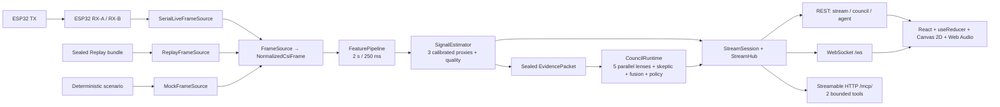

# 系统架构

本文以当前实现为准。系统已经验证确定性 Mock 与封存 Replay；Live 串口链路有 fake-transport 测试，但尚未完成三块真实 ESP32、房间标定、30 分钟运行和 held-out 指标，因此不能把 Replay 结果写成现场能力。

## 1. 总体结构



实时信号链不等待 Agent。Council 只读取 `EvidencePacket` 中的标量摘要和三代理信号，不读取 raw CSI；Provider 离线或超时时，信号与 WebSocket 仍继续运行。

## 2. 模块职责

| 目录 / 组件 | 当前职责 | 明确不做 |
| --- | --- | --- |
| `firmware/csi_tx` | 固定信道/带宽发包，写入递增序号与状态遥测 | 信号推理、动态猜测信道 |
| `firmware/csi_rx` | CSI 回调复制紧凑记录到 frame pool，过滤并经二进制串口输出 | 回调内解析、FFT、CSV、阻塞 I/O |
| `services/collector` | 二进制解析、CRC、双链路按 TX seq 配对、Mock/Replay/Live Source、append-only raw bundle | 猜串口、修改原始事实、插补丢失 CSI |
| `services/sensing` | 因果清洗、窗口、特征、标定、三代理信号、质量门、Evidence 封存 | LLM 调用、人物/物体识别 |
| `services/council` | 五角色受限提案、skeptic 质询、回应、Policy、Fusion、store、七角色展示投影与可选审计 | 创造测量、写回 Evidence、用共识抬分 |
| `services/api` | 单个进程内 `StreamSession`、恢复缓冲、REST、WebSocket、Agent/MCP 适配和可选静态 Web | 浏览器状态作为服务端真相、多进程共享会话 |
| `packages/contracts` | Pydantic 单一结构源，生成 JSON Schema 与 TypeScript 类型 | 业务计算 |
| `apps/web` | 连接/序列恢复、React reducer 状态、审计视图、Canvas 2D 推断场、Web Audio、局部视觉书签 | 在浏览器重算正式信号、持有 API key、把图形称为相机图像 |

## 3. 三种 Source 的共同边界

```python
class FrameSource(Protocol):
    async def open(self) -> SourceManifest: ...
    def frames(self) -> AsyncIterator[NormalizedCsiFrame]: ...
    async def pause(self) -> None: ...
    async def resume(self) -> None: ...
    async def close(self) -> None: ...
    async def health(self) -> SourceHealth: ...
```

| 模式 | 输入 | 已验证范围 | 必须显示的边界 |
| --- | --- | --- | --- |
| Mock | 固定 seed 的场景生成器 | 确定性、故障、前后端回归 | `SIM · MOCK`，不是现实测量 |
| Replay | checksum 校验后的 `raw.csi.zst` | 全链路 E2E、seek/step、loop、soak、发布演示 | `SIM · REPLAY`；当前 demo fixture 为模拟录制 |
| Live | 两个显式 RX 串口 + 匹配 topology/calibration | 实现和 fake-transport 测试 | 真实硬件门未通过；配置不完整时 fail closed |

Live 不自动猜端口。它要求 `rx-a`、`rx-b`、真实 `LIVE_TOPOLOGY_HASH` 和匹配且非模拟的 calibration profile；任一前置条件缺失就拒绝启动。目标拓扑是 1 TX + 2 个非共线 RX。

## 4. 实际数据路径

1. TX 按约 100 packets/s 的目标节奏发包；RX-A/RX-B 对指定 TX 获取 CSI，并让回调快速入队后返回。
2. Collector 校验 wire version、长度、CRC、序号和时间，生成带 `session_id`、`source_mode`、link、质量与哈希标识的 `NormalizedCsiFrame`。
3. `FeaturePipeline` 使用默认 2 秒窗口、250 ms stride，执行严格因果清洗并生成 `FeatureWindow`；双 RX 按 TX seq 配对，不假设跨设备载波相位同步。
4. `SignalEstimator` 只基于匹配的版本化标定输出：`motion_intensity`、`occupancy_density_proxy`、`depth_zone_proxy`、每信号置信、质量和 explicit unknown。
5. `EvidenceTrigger` 在首个候选、稳定状态变化（默认连续 3 窗口）或 3 秒冷却条件满足时，`EvidenceBuilder` 封存一个 hash 绑定的 `EvidencePacket`。为连续分析展示，流在没有更早触发时另以约 7 秒刷新目标封存最新代理快照；这不改变采样、代理值或质量。
6. `CouncilScheduler` 提交最新 Evidence。一个周期运行时只保留一个最新 pending 槽；中间 Evidence 可被替换，但信号事件不等待 Council。
7. Council 完成 hash/质量门，并发执行五角色首轮提案，再执行 skeptic、必要回应、Policy 和可选 synthesis；安全的增量结果会在周期内逐步推送，最终 `CouncilStore.commit` 使用 sequence guard。Provider 协议、Mock、OpenAI 与 DeepSeek 分模块实现；`grounding.py` 为 Mock 与 DeepSeek 提供同一组公开确定性证据辅助函数，`presentation.py` 再把已封存数据与已审查结论投影为四类角色状态、怀疑判断、五轴共识运动和 Fusion 互动，不写回测量。
8. `StreamHub` 发送 snapshot 与实时事件；浏览器只按单调 sequence 应用，断线后用 `last_sequence` 恢复。

不使用跨 RX 相位、AoA、TDoA 或绝对 ToF；相对纵深不是米制距离。

## 5. 运行时与背压

- 当前 API 一次只持有一个 `StreamSession`；它拥有实际 Council runtime。`/council/*` 和 `/api/agent/*` 读取同一 session runtime，未启动流时才使用空的 fallback runtime。
- `StreamHub` 的恢复 ring buffer 上限是 400 个事件，snapshot 状态事件上限 180；客户端只取最近状态，不无限积累。
- Live serial frame outbox 和 raw recording worker queue 均有界（默认 10,000）。raw 录制队列满或写盘失败会让 session 进入 error，而不是静默丢弃原始事实。
- Council 是一个 active task + 一个最新 pending Evidence；旧 sequence 不能覆盖新结果。session 内只保留一份上一周期解释快照供确定性 continuity 比较，seek 或 session 重置时清空。
- Replay/Mock presentation loop 每轮创建新 session id；Live 永不自动循环。
- 单进程内 session、Council store 和 WebSocket buffer 没有分布式共享层，因此生产部署固定一个 Uvicorn worker。

## 6. 当前 HTTP 与 WebSocket API

| 方法 | 路径 | 作用 |
| --- | --- | --- |
| GET | `/healthz` | API、source/sensing、Council、contracts 健康摘要 |
| GET | `/api/replay/bundles` | 列出 checksum 验证结果；公网模式只暴露 `demo_2min` |
| GET | `/api/replay/bundles/{bundle_id}` | 单个 Replay manifest 与校验结果 |
| GET | `/api/stream/status` | 当前单 session 状态 |
| POST | `/api/stream/start` | 本地模式启动 replay/mock/live |
| POST | `/api/stream/control` | pause/resume/step/seek/rate/record/start/stop |
| POST | `/api/stream/stop` | 幂等停止 |
| GET | `/api/stream/metrics` | 窗口延迟、事件速率、队列、帧/窗统计 |
| GET/POST | `/api/stream/faults[/{fault}]` | 查看/注入确定性故障；公网 mutation 禁用 |
| GET | `/council/health` | active Provider 及 OpenAI/DeepSeek 配置状态 |
| GET | `/council/usage` | 调用、attempt、token、延迟汇总 |
| GET | `/council/cycles[...]` | cycle、claims、challenges、rejections 审计视图 |
| GET | `/api/agent/latest` | 立即返回最新只读 Agent reading |
| POST | `/api/agent/query` | 等待一个现有 Council 结果；可要求匹配的 OpenAI/DeepSeek 调用 |
| POST | `/api/agent/invoke` | 对最新封存证据执行一次缓存的真实 Provider Council |
| POST | `/mcp/` | MCP Streamable HTTP；initialize/list/call 两个有明确注解的 tools |
| WS | `/ws?last_sequence=N` | snapshot、catch-up、实时信号和 Council 事件 |

当前没有 `/api/sessions/*` 或 `/api/calibrations/*` REST。会话由 `/api/stream/*` 管理；标定通过 `wsc-calibration` / `scripts/calibration_wizard.py` 与 profile 文件完成。

MCP 使用官方 Python SDK 的无状态 Streamable HTTP transport；`/mcp` 重定向到规范的 `/mcp/`。为降低自动评测的工具选择成本，只公开两个 tools：`get_system_health`（read-only）和 `invoke_room_echo`（一次完整、缓存的真实 Provider Council 调用；标注为 open-world、non-destructive、idempotent）。它们不公开 resources/prompts、source 控制、raw CSI、凭据、MAC 或文件路径。`invoke_room_echo` 只读取 active session 最新通过质量门的紧凑 EvidencePacket，不启动第二个数据源；请求体上限 65,536 bytes，输出显式携带 quality、truth boundary 和 Provider provenance。`tests/api/test_mcp_api.py` 使用官方 client 覆盖 `initialize -> tools/list -> 两个 tools/call`。

WebSocket envelope 使用 `ws-event.v1`、`session_id`、单调 sequence 和 `emitted_at`。主要事件为 `session.status`、`source.health`、`signal.frame`、`quality.update`、`cycle.started`、`agent.claim`、`agent.challenge`、`agent.response`、`policy.rejection`、`synthesis.result`、`alert`、`heartbeat`。`cycle.started.signal_snapshot` 把 Agent 展示绑定到该轮封存状态，避免使用后来到达的 triplet。

## 7. Web 实现边界

Web 的实际栈是 React 18 + TypeScript strict + Vite：

- `StreamProvider` 使用 React Context + `useReducer`，不是 Zustand；
- `lib/router.ts` 是轻量 hash router，数据请求使用原生 fetch/WebSocket，不是 TanStack Router/Query；
- 推断场、数字字形和三条趋势线使用 Canvas 2D，不是 WebGL；
- 数字场只消费 signal/quality；Agent 响应层只叠加角色颜色和短暂涟漪，不能写回 signal reducer、Canvas 测量参数或置信；
- 音频使用 gesture-gated Web Audio，默认静音，pause/finished/blur 时淡出；
- Lenis 只处理滚动，不进入数据或推理链；
- `localStorage` 最多保存 32 个 source/session 隔离的代理量视觉书签，不保存 raw CSI，也不改变信号或置信。

所有生成图形必须标注为 inference field / not a camera image。unknown/stale 时清除信号驱动状态；UI theme、pointer、scroll 和视觉书签都不能反向修改测量。

## 8. 存储与可重复性

一个 sealed Replay bundle 的当前必需文件由 manifest 列出，标准 fixture 包含：

```text
manifest.json
raw.csi.zst
events.jsonl
checksums.sha256
```

派生的 `features.parquet` 可重算；校准 trial 的 `ground_truth.json` 只供离线验收，永不进入 Replay/Council 输入。Bundle verifier 拒绝路径穿越、绝对路径、symlink escape、缺文件、checksum 错误、不完整状态和超大解压数据。

运行时输出：

- `data/raw/`：用户显式开启录制后生成的 append-only raw bundle；
- `data/derived/stream/{session}.events.jsonl`：API 流事件；
- `data/derived/council/*.audit.jsonl`：显式启用 Council audit 的 CLI/运行；
- `data/calibration/*/profile.json`：版本、拓扑、过期和 checksum 约束的标定 profile。

原始记录不被派生流程覆盖；派生数据应由 raw + 版本化 profile/config 重算。

## 9. 本地、同域公网与 Provider 部署

本地开发使用两个进程：FastAPI `:8000`，Vite `:5173`；Vite 仅把 `/healthz`、`/api`、`/ws` 代理到 API。生产同域模式先构建 `apps/web/dist`，再由 FastAPI 在所有 API/WS 路由之后挂载静态资源：

```bash
make submission-demo PORT=8000
# http://127.0.0.1:8000/#/home
```

`PUBLIC_REPLAY=1` 会强制 `replay/demo_2min/autostart/loop`，禁止匿名 REST 与 WebSocket 控制、录制和故障注入。它是固定的模拟 Replay，不是 Live，也默认使用 Mock Provider 来保证可重复和成本有界。

真实 OpenAI 或 DeepSeek Provider 必须在服务端配置对应 key，并单独完成 opt-in smoke 或同步 `/api/agent/invoke` 验证；仅仅设置环境变量或看到 `health=configured` 不等于真实调用已通过。DeepSeek 只生成角色叙事子结构，测量、证据引用、受控反应和多模态参数由服务器从 sealed packet 确定性回填。证明必须同时包含匹配的 `provider`、模型名、`status=ok` 的实际调用数以及 propose/cross-examine/synthesize 阶段。公开模型调用在增加鉴权、速率和成本限制前不应接入无限循环。

## 10. 安全与隐私

- 默认开发服务绑定 localhost；公网使用同域部署，不启用宽泛 CORS。
- API key 只存在于 Council 服务端环境，不进入固件、浏览器 bundle、fixture、日志或截图。
- TX 标识以 hash 形式进入合约；浏览器默认只收到派生信号、质量、Evidence 摘要和 Agent 结果。
- raw CSI 仍是敏感环境传感数据：本地优先、显式录制、可审计导出/删除，不以“无摄像头”等同于“无隐私风险”。
- Public Replay 只暴露 sealed fixture；REST/MCP 不接受任意文件路径，匿名调用不能启动 Mock/Live 或注入故障。

## 11. 当前未完成项

- 三块真实 ESP32 的角色/端口/天线/固件与房间几何记录；
- 非模拟 calibration profile、现场 30 分钟运行和同房 held-out 指标；
- Live-vs-Replay 比较与正式硬件验收；
- OpenAI Provider 的 credential-gated smoke 仍为 opt-in；DeepSeek 已在部署
  `b034b99` 上重新完成 10 次真实调用的完整 Council 证明，后续新部署仍须重新
  记录 provider、模型、实际调用次数和阶段覆盖，不能沿用本次证明。

MCP 已通过 `initialize -> tools/list -> tools/call` 协议测试；它是只读评测适配层，不会替代上述硬件或真实 Provider 验证。
