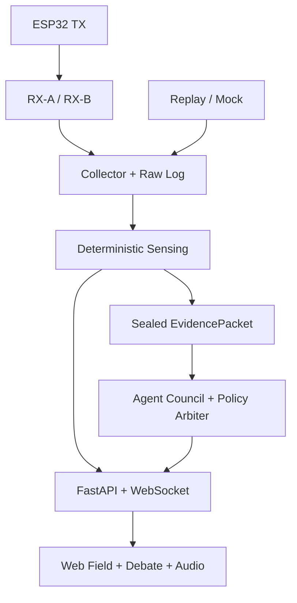

# 系统架构

## 1. 总体结构



关键分离：实时信号链不等待 Agent；Agent 只读取已封存的特征和三信号，不读取原始 CSI。

## 2. 服务职责

| 模块 | 职责 | 不允许做 |
| --- | --- | --- |
| `firmware/csi_tx` | 固定信道/带宽发送带序号的数据包；状态遥测 | 信号推理、动态换信道 |
| `firmware/csi_rx` | CSI 回调复制到 ring buffer、包过滤、二进制串口输出 | 回调内 CSV、FFT、日志洪泛、阻塞 I/O |
| `collector` | 发现串口、解析、主机时间戳、双链路按 seq 配对、原始录制 | 修改原始帧、推测丢失值 |
| `sensing` | 清洗、窗口、特征、标定、三信号、测量质量 | LLM 调用、文字解释 |
| `council` | 专家主张、交叉质询、修订、综合与审计 | 创造数值、写回证据 |
| `PolicyArbiter` | schema、证据引用、越权、置信上限与阻断挑战校验 | 调用 LLM、主观改变阈值 |
| `api` | Session、Replay、Calibration API；WebSocket 事件 | 持有 UI 状态真相 |
| `web` | 状态、曲线、证据、争论、推断场、声音、回放 | 在浏览器重算正式信号、暴露 API key |

## 3. 数据路径

1. TX 以稳定节奏发包，包中含递增 `seq`。
2. RX-A/RX-B 捕获来自指定 TX MAC 的 CSI，串口发送 `RawFirmwareFrame`。
3. Collector 校验 CRC、字段、单调时间和序号，并写入 append-only raw log。
4. `FrameSource` 将 live、replay 或 mock 统一转换为 `NormalizedCsiFrame`。
5. Sensing 使用 2 s 窗口、250–500 ms 步长生成 `FeatureWindow` 和 `SignalTriplet`。
6. 每当显著状态连续三个窗口变化，或冷却时间到达，封存 `EvidencePacket`。
7. 当前没有 Agent 周期运行时，Council 对最新证据启动；运行中出现新证据只保留最新候选，丢弃过期中间周期。
8. PolicyArbiter 校验所有 Agent 输出；最终结果与 `evidence_hash` 绑定。
9. API 以不同通道发送高频信号事件和低频 Agent 事件。
10. Web 以最新 sequence 应用事件，生成视觉和声音参数。

## 4. 统一 Source 接口

```python
class FrameSource(Protocol):
    async def open(self) -> SourceManifest: ...
    def frames(self) -> AsyncIterator[NormalizedCsiFrame]: ...
    async def pause(self) -> None: ...
    async def resume(self) -> None: ...
    async def close(self) -> None: ...
```

实现：`MockFrameSource`、`ReplayFrameSource`、`SerialLiveFrameSource`。所有后续处理只依赖此接口。

## 5. 并发与背压

- 串口读取、原始写盘、信号计算、Agent 分析、WebSocket 广播使用有界队列。
- 原始写盘不允许主动丢包；若磁盘跟不上，Session 进入 error 并停止采集。
- UI 队列拥堵时可丢弃中间可视帧，只保留最新快照与所有状态转换。
- Agent 队列长度最大为 1 个运行周期 + 1 个最新待处理证据。
- 过期 Agent 结果若 `cycle.sequence < current.sequence`，不得覆盖新结果。

## 6. 时间与同步

- 设备时钟只用于单设备顺序；主机接收时间用于跨服务时间线。
- 双 RX 依靠 TX 序号进行包级配对，不假设设备时钟或载波相位同步。
- MVP 不使用跨 RX 相位、AoA、TDoA 或绝对 ToF。
- Replay 保留原始 device timestamp、host timestamp 和播放 virtual clock。

## 7. 频率与延迟预算

| 环节 | 目标 |
| --- | --- |
| TX 包速率 | 100 packets/s 目标，现场验收 |
| 每链路原始 CSI | 接近 TX 速率；以实际质量门为准 |
| 信号窗口 | 2 s；步长 250–500 ms |
| Web 三卡/曲线 | 4–10 Hz |
| Agent 触发 | ≥3 s 冷却，或稳定状态变化触发 |
| 信号→Web p95 | <300 ms |
| Agent 周期目标/硬上限 | <8 s / 15 s |

## 8. API

```text
POST /api/sessions
POST /api/sessions/{id}/start
POST /api/sessions/{id}/pause
POST /api/sessions/{id}/stop
GET  /api/sessions/{id}/snapshot
GET  /api/sessions/{id}/export
GET  /api/replays
POST /api/replays/{id}/verify
POST /api/calibrations
GET  /api/cycles/{cycle_id}
WS   /ws/sessions/{id}?last_sequence=N
```

WebSocket 事件至少包括：`session.status`、`source.health`、`signal.frame`、`quality.update`、`cycle.started`、`agent.claim`、`agent.challenge`、`agent.response`、`policy.rejection`、`synthesis.result`、`render.update`、`alert`、`heartbeat`。

## 9. 存储

Replay bundle：

```text
manifest.json
raw.csi.zst
events.jsonl
features.parquet
ground_truth.json
checksums.sha256
```

`ground_truth.json` 仅供离线验收，绝不进入 Agent 输入。回归测试使用 `recompute=true`，从 raw 重新计算；预计算特征只为快速展示。

## 10. 安全与隐私

- 串口端 TX MAC 在落盘前用 session salt 哈希。
- 默认绑定 localhost；局域网开放必须显式配置允许来源。
- API key 只在 Council 服务端；日志只写模型、耗时、token、schema 结果，不写密钥。
- 原始 CSI 可能泄露占用和活动模式，按敏感传感数据处理：本地优先、可配置保留期、明确导出和删除。
- 浏览器只接收派生信号、质量和必要证据摘要；默认不发送完整原始 IQ。

## 11. 部署边界

MVP 是单机本地部署：ESP32 → USB → 开发机 → 浏览器。Docker 可用于 API、Council 与 Web，但串口 Live 模式需显式映射设备；Firmware 工具链可保持宿主安装。不要在 MVP 前期引入 Kafka、Kubernetes、向量数据库或分布式 tracing。

