# 数据端口与多模态延伸指南

本文回答两个问题:CSI 检测的数据从哪个端口进入、以什么结构流动;Agent
推理的输入/输出端口是什么。末尾给出多模态延伸的接入点与不变量。

## 1. 总览

```mermaid
flowchart LR
  TX[ESP32 csi_tx] -->|Wi-Fi 空口| RX[ESP32 csi_rx x2]
  RX -->|USB 串口 921600| COL[collector: SerialLiveFrameSource]
  COL -->|NormalizedCsiFrame| PIPE[sensing: FeatureWindow]
  PIPE -->|SignalTriplet| SEAL[evidence: EvidencePacket 封存]
  SEAL -->|证据哈希+evidence_index| COUNCIL[Agent Council]
  COUNCIL -->|AgentClaim/Challenge/CouncilResult| API[FastAPI WS]
  API -->|/ws 事件| WEB[React 前端]
```



整条链路有三种等价源模式:`mock`、`replay`、`live`。契约层保证三者共享
相同的 `FeatureWindow` / `SignalTriplet` / `EvidencePacket` 结构
(见 `packages/contracts/wifi_contracts/` 与 `schemas/` 生成的 JSON Schema)。

## 2. CSI 检测数据端口

### 2.1 硬件串口端口(物理层)

- 拓扑:1 个 TX 板(`firmware/csi_tx`)+ 2 个 RX 板(`firmware/csi_rx`),
  推荐非共线摆放;单 RX 降级时 depth 输出强制 unknown。
- 配置入口:环境变量
  `RX_PORTS=rx-a=/dev/ttyUSB0,rx-b=/dev/ttyUSB1`,由
  `services/api/wifi_api/config.py:get_rx_ports()` 解析。
- 读取实现:`services/collector/wifi_collector/serial_live.py`
  `SerialLiveFrameSource`(pyserial,波特率 921600,每链路独立 reader 线程,
  断线重连、epoch 复位防错配)。
- 线协议:`firmware/shared` + `services/collector/wifi_collector/wire_protocol.py`
  (`FRAME_TYPE_DATA` / `FRAME_TYPE_STATUS`,CRC-32,紧凑二进制)。
- 硬件验收门槛:只有 `scripts/hardware_validate.py` 确认三个串口角色
  (TX / RX-A / RX-B)后才允许 flash 与标定;端口不确认时一律
  `blocked_by_hardware`,绝不猜测设备。

### 2.2 归一化帧端口(进管线的第一个结构)

- 模型:`NormalizedCsiFrame`
  (`packages/contracts/wifi_contracts/frames.py`)。
- 关键字段:`link_id`、`rx_id`、`seq`、`device_ts_us`、`host_ts_ns`、
  `channel`、`bandwidth_mhz`、`rssi_dbm`、`noise_floor_dbm`、
  `csi_iq`(int8 幅相序列)、`quality`。
- 注意:`csi_iq` 是数组,永不允许进入 Agent 输入;它是 append-only 原始
  捕获,可派生、可复现,但不可修改。

### 2.3 特征窗口端口(Agent 可消费的倒数第二层)

- 模型:`FeatureWindow`(`packages/contracts/wifi_contracts/signals.py`)。
- 每链路特征:`LinkFeatures` —— `packet_coverage`、`subcarrier_coverage`、
  `amplitude_median`、`amplitude_mad`、`temporal_diff_rms`、
  `spectral_band_energy`、`shape_correlation_to_baseline`、
  `robust_variance`、`amplitude_anomaly_ratio`、`spectral_entropy`、
  `valid_carrier_ratio` 等。
- 链路对特征:`PairedFeatures`(跨 RX 的扰动分数与幅形不对称,不取原始相位)。
- 特征版本号 `feature_version` 参与可复现性;`WindowQuality` 记录
  干扰分数与 OOD 标志。

### 2.4 三信号端口(标定后的代理)

- 模型:`SignalTriplet`(`packages/contracts/wifi_contracts/signals.py`)。
- `motion`:连续 0–1 标量,状态 `idle/micro_motion/moving/fast_change/unknown`。
- `occupancy_density`:遮挡/空间占用代理,概率分布
  `low/medium/high/unknown`。
- `depth_zone`:相对纵深代理,概率分布 `near/mid/far/unknown`,不是米制距离。
- 不变量:`sensor_confidence_cap` 必须 ≥ 每个信号置信;`final_claim_confidence
  <= sensor_confidence_cap` 在代码与测试中强制。

### 2.5 证据包端口(唯一封存快照)

- 模型:`EvidencePacket`(`packages/contracts/wifi_contracts/evidence.py`)。
- 组成:`source_manifest`、`window_summary`、`topology`、`calibration`、
  `quality`、`signals`、`evidence_index`(标量索引,供
  `EvidenceResolver` 解析 `evidence://` refs)、`raw_ref`、`evidence_hash`。
- 封存规则:`EvidencePacket.create()` 由载荷计算 sha256 哈希,任何字段变化
  都会破坏哈希;Agent 只能读,不能改。

### 2.6 实时事件端口(WebSocket)

- 入口:`/ws`(`services/api/wifi_api/ws.py`),消息结构见
  `WebSocketEnvelope`(`packages/contracts/wifi_contracts/events.py`)。
- 与 CSI 检测相关的事件:
  - `signal.frame`:`payload.triplet` = `SignalTriplet`(高频,60 FPS 前端不卡)。
  - `quality.update`:窗口质量、覆盖率、链路健康、quality_flags。
  - `cycle.started`:证据封存事件,`cycle_id` + `evidence_hash`。
  - `snapshot`:新连接时的 `latest_triplet` / `latest_result` /
    `recent_events` 回放缓冲。

## 3. 推理数据端口

### 3.1 输入端口(Agent 的唯一输入)

- 协议:`AgentProvider.propose(role, packet: EvidencePacket, prompt)`
  (`services/council/wifi_council/provider.py`)。
- 输入不变量:Agent 只消费 `EvidencePacket`,绝不读取 raw CSI 数组;
  文本与 refs 必须落在 `evidence_index` 标量内。
- 证据解析:`EvidenceResolver.resolve(packet, ref)`
  (`services/council/wifi_council/policy.py`),ref 形如
  `evidence://{evidence_hash}/signals/motion/state`;hash 不匹配、ref 不存在、
  引用非标量都会产生确定性拒绝。
- 提示词端口:`PromptVersion`(`services/council/wifi_council/prompts.py`),
  每个角色一条版本化、带 sha256 的指令,随调用进入 provenance。

### 3.2 知识库端口(联网检索的静态落地)

- 路径:`data/knowledge/{role}.json`,每文件含 `persona`(名字/图腾/格言)与
  `entries`(concept / source / url / relevance / rule)。
- `rule` 字段是信号状态到意象的确定性映射
  (如 `motion_idle -> 气缓;occupancy_low -> 气散/开阔`),mock provider
  按此解析出 `ReadingLayer` 与 `analysis_steps` 的 map 步骤。
- 来源 URL 进入 `AgentClaim.sources`,前端以小字展示并可点击。

### 3.3 输出端口(结构化产物)

- 提案层:`SpecialistProposal`(`services/council/wifi_council/outputs.py`)
  —— 不含任何数值字段,Agent 无法凭空加测量值。
- 主张层:`AgentClaim`(`packages/contracts/wifi_contracts/council.py`):
  - `proposition`:一句话结论(隐喻解读带“(隐喻解读)”标注)。
  - `systematic_reading`:`headline` + `scene_sketch` + 三信号 `layers`
    (signal/state/metaphor/explanation)+ `narrative` + `boundary_notes`
    + `multimodal_hints`。
  - `analysis_steps`:`observe → retrieve → map → reason → conclude`
    可见推理轨迹,每步带自己的 `evidence_refs`。
  - `sources` / `assumptions` / `alternative_explanations` /
    `falsification_test` / `reasoning_summary`。
- 挑战层:`AgentChallenge`(skeptic 的交叉质询,类别、严重度、
  `resolution_test`);策略层:`PolicyRejection`(确定性拦截,带 reason_code)。
- 合成层:`CouncilResult`(headline/summary/alternatives/limitations +
  `sensor_confidence_cap` / `model_support` / `display_confidence` /
  `interpretation_agreement`)。
- 实时出口:`agent.claim`、`agent.challenge`、`policy.rejection`、
  `synthesis.result` 事件;前端 `apps/web/src/views/CouncilView.tsx` 消费。

### 3.4 执行控制端口

- 编排:`CouncilOrchestrator`(`services/council/wifi_council/orchestrator.py`)
  负责 propose → cross_examine → respond → policy → synthesize → commit,
  并把提案转成 `AgentClaim`。
- 预算:默认 8 次调用/周期(5 提案 + skeptic + respond + fusion),
  `max_challenges_total` 限制挑战数。
- 确定性:mock 固定 seed,同一 `evidence_hash` + role 永远得到同一
  解读;OpenAI provider 走 `SpecialistProposal` Structured Outputs,
  无 key 时离线回退 mock,UI 从不等待 LLM。

## 4. 多模态延伸接入点

你想把声音、图像、IMU、温湿度等其他模态接进来时,按下面四条原则扩,
不要在旧链路上打洞:

1. **平行数据通道**:新模态走自己的
   `{Modality}Frame → {Modality}FeatureWindow → {Modality}Triplet` 管道,
   最后并入/并列于 `EvidencePacket`。最省事的做法:新增模态的标量进入
   `evidence_index`(例如 `modalities/audio/level`),复用 seal + resolver
   机制,Agent 和 Policy 立刻就能引用。
2. **契约版本化扩展**:所有模型 `extra="forbid"`。新增字段要带默认值
   (向后兼容),或 bump `schema_version` 并保留旧解析;改完重跑
   `scripts/generate_schemas.py && generate_types.py && generate_fixtures.py`
   并 `make verify-contracts`。
3. **边界与置信不变**:多模态输出仍是代理/测量,不是“CSI 增强”;
   每类模态需要自己的标定 profile、质量门与 Policy 规则
   (例如麦克风要隐私评估,视觉布局图只允许遮挡标注,不做个体识别)。
   隐喻解读继续带“(隐喻解读)”,`final_claim_confidence` 依旧受
   `sensor_confidence_cap` 约束。
4. **前端扩展位**:新模态卡片 + 事件类型 + 路由段;推理侧新增
   模态专属 Agent 角色或让现有角色在 `multimodal_hints` 里说明
   “接入 X 后如何对照验证”(当前每个角色已内置 2 条提示)。

### 推荐的延伸顺序

1. 声学(真实麦克风或环境声级):最容易与 `soundscape` 对照。
2. 占用布局图(仅遮挡标注):与 `architecture` / `occupancy` 对照。
3. 温湿度/光照:与 `feng_shui` 风感意象对照。
4. IMU/结构振动:与 `biota` / `soundscape` 低频纹理对照。
5. 问卷/访谈(需知情同意):与 `psyche` 空间心境对照。

## 5. 快速验证

```bash
make verify-contracts          # 契约、TS 类型、fixtures 无漂移
uv run python -m pytest -m "not hardware"   # 全量后端(约 6 分钟)
npm --prefix apps/web run test # 前端
cd apps/web && npx playwright test --config playwright.e2e.config.ts  # 全栈
```
